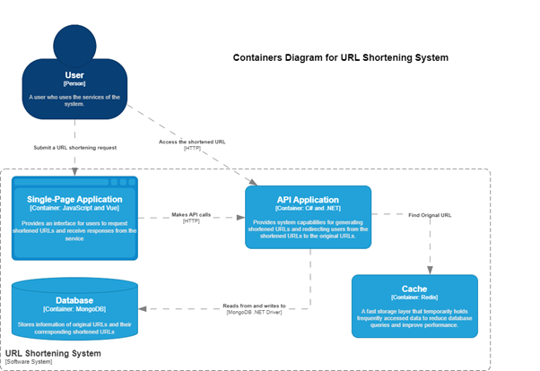

# URL Shortener System

A full-stack URL Shortener application designed with a focus on clean architecture, performance, and containerized deployment.

The system allows users to generate short URLs and perform fast redirection by combining persistent storage with in-memory caching.

---
## Project Structure

```
URLshortener/
├── backend/
├── frontend/
├── container-diagram.png
├── docker-compose.yml
└── README.md
```
## Features

- Generate short URLs from long URLs
- Redirect short URLs to original destinations
- RESTful API with validation and error handling
- High-performance redirection using Redis caching
- Fully containerized using Docker and Docker Compose

---

## Tech Stack

### Backend
- ASP.NET Core
- RESTful API
- MongoDB

### Cache
- Redis

### Frontend
- Vue.js

### Infrastructure
- Docker

---

## Architecture



The system is composed of multiple containers managed by Docker Compose:

- **Backend (ASP.NET Core)**  
  Handles URL creation and redirection logic.

- **Frontend (Vue.js)**  
  Provides a lightweight UI for submitting URLs and displaying shortened links.

- **MongoDB**  
  Stores mappings between short URLs and original URLs.

- **Redis**  
  Caches frequently accessed short URLs to reduce database load and improve redirection performance.

---

## Data Flow

1. User submits a long URL via the frontend.
2. Frontend sends a request to the backend REST API.
3. Backend validates the input and generates a short code.
4. URL mapping is stored in MongoDB.
5. Redis caches frequently accessed short URLs.
6. When a short URL is accessed, the system redirects the user to the original URL.

---

## Getting Started

### Prerequisites
- Docker

### Run the application

```bash
git clone https://github.com/DangBach1410/URLshortener.git
cd URLshortener
docker-compose up --build
```

All services (backend, frontend, MongoDB, Redis) will be started automatically.

---
## Application Access

After starting the system with Docker Compose, the services can be accessed as follows:

- **Frontend (Web UI):**  
  `http://localhost:8080`

- **Backend API:**  
  `http://localhost:5168`

> Port numbers may vary depending on your Docker Compose configuration.


